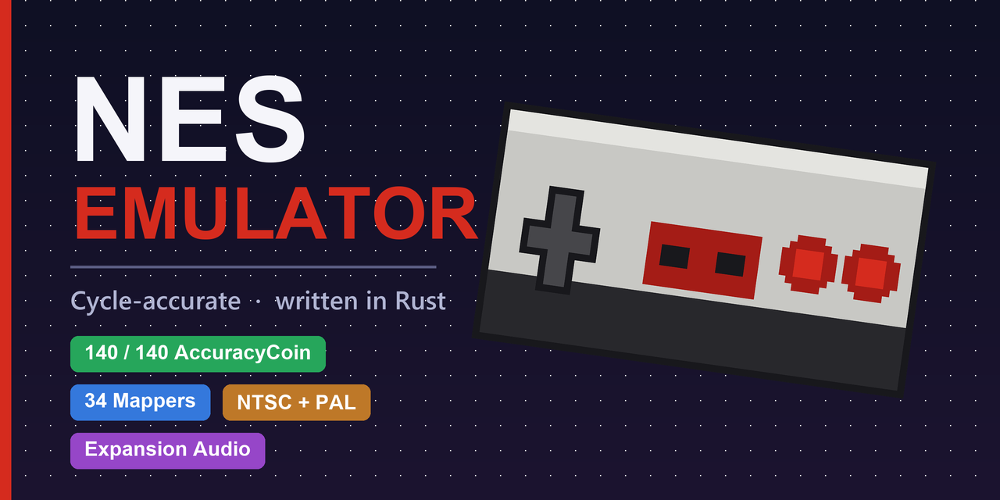

# NES Emulator

A NES (Nintendo Entertainment System) emulator written in Rust. Video, audio and
input, NTSC and PAL machines (auto-detected from the ROM header), and 35 mappers
- with expansion audio for the MMC5, VRC6, VRC7, N163 and Sunsoft 5B - covering games
such as Super Mario Bros. 1–3, Battletoads, Mega Man, Punch-Out!!, Gimmick!,
Akumajou Densetsu, Lagrange Point and Castlevania III. See [docs/mappers.md](docs/mappers.md)
for the full mapper list with descriptions and notable games.

Passes all **140 / 140** tests of the hardware-verified
[AccuracyCoin](https://github.com/100thCoin/AccuracyCoin) accuracy suite and
`nestest` with cycle-exact logging - see [docs/accuracy.md](docs/accuracy.md).

## Running

### From a prebuilt release

Every push to `main` builds release archives for Windows, Linux and macOS
(see the *Artifacts* section of a [CI run](../../actions)). Each archive
contains the binary plus a platform-specific `RUNNING.md` with setup steps:

- [Windows](docs/running-windows.md) - `nes-emulator-windows-x64.zip`
- [Linux](docs/running-linux.md) - `nes-emulator-linux-x64.tar.gz`
- [macOS](docs/running-macos.md) - `nes-emulator-macos-universal.zip` (universal: Intel + Apple Silicon)

### From source

```
cargo run --release                  # opens the home menu
cargo run --release -- path\to\rom.nes   # skips the menu, boots the ROM directly
```

The home menu offers **Load ROM** (native file picker), **Settings**, **Resume**
(when a game is loaded) and **Quit**. Settings lets you rebind every controller
button for either player (toggle the EDIT PLAYER row, select a button, press
Enter, then press the new key), change the window scale, toggle NTSC overscan
cropping and reset defaults; everything is persisted to
`nes-emulator-config.json`.

## Default controls

| NES button | Player 1 | Player 2 |
|---|---|---|
| D-Pad | Arrow keys | W A S D |
| A | Z | L |
| B | X | K |
| Start | Enter | M |
| Select | Right Shift | N |

| Action | Key |
|---|---|
| Back to menu | Escape |
| Reset console | F3 |
| Save state | F5 |
| Load state | F7 |
| Fullscreen | F11 / double-click |

Per-player button bindings (except Escape, the **F3** reset key and the F5/F7
savestate keys) can be changed in Settings. **F3** soft-resets the console (the
RESET button) - execution jumps back to the cartridge's reset vector with RAM
intact, just like the hardware. **F5** pauses the game and opens a 4-slot save picker;
**F7** opens the matching load picker (↑/↓ to choose a slot, Enter to confirm,
Escape to cancel). Each slot is written to `<rom>.stateN` next to the ROM, and a
restore resumes exactly where you left off - mid-frame.

**Gamepads** are auto-detected (via `gilrs`): plug one in and it drives player 1,
a second drives player 2. The bottom and right face buttons are A and B, Start
and Select map straight across, and directions come from either the D-pad or the
left analog stick. No setup needed - the keyboard stays active alongside.

## Architecture

- `src/cpu.rs` - cycle-stepped 6502 core: every CPU cycle performs exactly one bus
  access, so instruction timing (page-cross/branch penalties, dummy reads and
  writes) falls out of the per-cycle access sequences. All official and unofficial
  opcodes. Per-cycle interrupt polling reproduces CLI/SEI/PLP I-flag latency,
  taken-branch interrupt delay, and NMI hijacking of BRK/IRQ vectors. DMC DMA
  halts with ghost (aborted 1-cycle) DMAs and APU-register bus conflicts.
- `src/ppu.rs` - dot-stepped PPU: loopy v/t/x/w scroll registers, per-dot background
  pipeline with shift registers (including their serial inputs), dot-accurate
  sprite evaluation through secondary OAM (misaligned OAMADDR, the buggy overflow
  scan, $2004 reads during rendering, OAM corruption), sprite X-counters with
  halted/counting modes, exact-pixel sprite 0 hit, the $2007 data-bus state
  machine with octal-latch feedback, buffered $2007 reads, palette mirroring,
  the odd-frame dot skip and the $2002 NMI-suppression race.
- `src/apu.rs` - APU ticked once per CPU cycle: pulse 1/2 (duty sequencer,
  envelope, sweep with pulse 1's ones'-complement negate, continuous mute logic),
  triangle (linear counter, DAC holds its value when halted), noise (15-bit LFSR,
  both tap modes), DMC (real memory fetches with 4-cycle CPU stall, $8000 address
  wrap, loop, IRQ). Frame counter in exact CPU-cycle timing: 4- and 5-step modes,
  the 3-cycle IRQ flag window at the end of mode 0, the 3/4-cycle $4017 write
  delay, IRQ inhibit. NTSC and PAL noise/DMC period tables and frame-counter
  timing. Non-linear mixer via the nesdev lookup-table formulas, then
  boxcar decimation to the host sample rate followed by the NES analog filter
  chain (90 Hz + 440 Hz high-pass, 14 kHz low-pass).
- `src/bus.rs` - CPU memory map, OAM DMA with 513/514-cycle stall, DMC sample DMA,
  APU register routing ($4000–$4013, $4015, $4017), 3 PPU dots and 1 APU step per
  CPU cycle interleave, NMI edge and level-triggered IRQ propagation.
- `src/mapper.rs` + `src/mapper/` - `Mapper` trait and implementations: NROM,
  MMC1, UxROM, CNROM, MMC3 (with the A12-clocked scanline IRQ counter), MMC5
  (game-compatible core: all banking modes, banked PRG RAM, ExRAM/fill
  nametables, ExGrafix extended attributes, fetch-pattern scanline IRQ,
  8x16 sprite CHR sets, multiplier and pulse/PCM audio; vertical split is
  not emulated), AxROM, MMC2 and MMC4 (tile-fetch CHR latches; MMC4 adds 16KB
  PRG banking and PRG RAM), Color Dreams, N163 (wavetable audio, nametables
  mappable to CHR ROM), VRC6 (pulse/saw audio, scanline and cycle IRQ; both the
  VRC6a and VRC6b pinouts), VRC7 (six-channel OPLL FM expansion audio plus the
  VRC scanline/cycle IRQ), BNROM/NINA-001, GxROM, FME-7 (CPU-cycle IRQ counter
  plus Sunsoft 5B audio), Camerica/Codemasters and Namco 108/DxROM (the
  pre-IRQ MMC3 ancestor). The full table lives in [docs/mappers.md](docs/mappers.md).
  Expansion audio is summed into the APU mix before decimation/filtering.
- `src/cartridge.rs` - iNES/NES 2.0 header parsing, mapper construction and
  NTSC/PAL region detection (NES 2.0 timing byte, legacy TV-system bit).
- `src/nes.rs` - frontend-agnostic console facade (run a frame, framebuffer,
  audio hooks, whole-machine savestates), shared by the GUI and the test harnesses.
- `src/savestate.rs` - `serde`-based savestate format: a full machine snapshot
  (CPU/PPU/APU/bus/controller/mapper) excluding host-only state (the framebuffer
  and the APU resampling/filter chain). See
  [docs/internals/08-savestates.md](docs/internals/08-savestates.md).
- `src/controller.rs` - standard joypad strobe/shift register.
- `src/gamepad.rs` - optional physical-gamepad input via `gilrs`; maps the first
  two connected pads to players 1 and 2, merged with the keyboard each frame.
- `src/main.rs` - winit 0.30 + pixels frontend, home/settings/running state machine,
  paced at 60.0988 FPS (NTSC) or 50.0070 FPS (PAL) while a game runs. Dynamic audio rate
  control nudges the resampling ratio (±0.3 %) so the audio queue hovers around
  50 ms instead of drifting into under/overflow.
- `src/audio.rs` - cpal output stream (f32/i16/u16 device formats) fed from a
  shared sample queue; underruns decay to silence to avoid clicks.
- `src/menu.rs`, `src/font.rs` - NES-style menu UI rendered into the same 256x240
  framebuffer (embedded 8x8 bitmap font, pixel-art icons).
- `src/config.rs` - persisted settings (key bindings, window scale).

Timing: 1 CPU cycle = 3 PPU dots (NTSC) or 3.2 PPU dots (PAL) = 1 APU step,
interleaved at bus-access granularity. NTSC frames are 89,342 dots (89,341 on
odd rendered frames); PAL frames are 312 scanlines (106,392 dots) with the
longer vblank and no odd-frame dot skip.

## Tests

```
cargo test
```

- `tests/nestest.rs` - CPU validated against the nestest golden log (registers and
  cycle counts for all official opcodes + unofficial NOPs, log lines 1–5259).
  Requires `tests/data/nestest.nes` and `tests/data/nestest.log` (skipped if absent).
- `tests/accuracycoin_rom.rs` - boots the full AccuracyCoin ROM and asserts all
  140 tests pass. Requires `AccuracyCoin.nes` in the project root (skipped if
  absent); CI downloads it automatically. See [docs/accuracy.md](docs/accuracy.md)
  for the interactive debugging harness (`examples/accuracy_rom.rs`).
- `tests/boot_smoke.rs` - boots commercial ROMs found in `testroms/` for a
  few seconds of emulated time and asserts the framebuffer shows a real picture
  (skipped per-ROM when absent, so CI stays green).
- `tests/holy_mapperel.rs` - runs the [Holy Mapperel](https://github.com/pinobatch/holy-mapperel)
  board-test ROMs from `testroms/` (mappers 0–4, 7, 9, 11, 66, 69) and asserts
  each shows "DETAILED TEST RESULT: 0000" - PRG/CHR banking, PRG RAM
  enable/write-protect, and mirroring all verified (skipped per-ROM when
  absent). Run with `--release`.
- `tests/accuracy_coin.rs` - fast ROM-less unit tests replicating a subset of the
  AccuracyCoin specifications: CPU instruction behavior, addressing-mode
  wraparounds, open bus, dummy reads/writes, and unofficial instructions.
- Unit tests cover loopy scroll register sequences, palette mirroring, $2007 read
  buffering, controller shifting, RAM mirroring, OAM DMA, and the APU (frame IRQ
  timing and inhibit, length counter load/countdown, sweep muting, DMC fetch and
  IRQ, audible pulse output).

ROMs are not included except for any you place in the project directory.

## License

This project is licensed under the GNU General Public License v3. See [LICENSE](LICENSE) for details.

